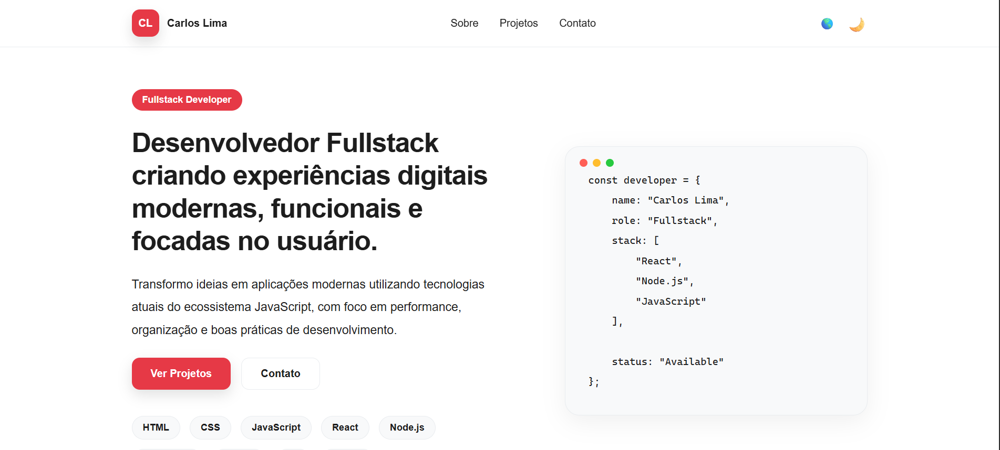

# Portfólio 2.0 — Carlos Lima

Portfólio profissional desenvolvido para apresentar minha trajetória, projetos, habilidades e conhecimentos como Desenvolvedor Fullstack.

O projeto foi construído com foco em organização, responsividade, boas práticas de desenvolvimento e uma experiência moderna em diferentes dispositivos.

## Tecnologias

- React
- Vite
- JavaScript
- CSS Modules

## Decisões técnicas

O projeto evoluiu de uma estrutura inicial para uma arquitetura mais organizada, buscando facilitar a manutenção, a reutilização de código e a evolução da aplicação.

## Organização por componentes

A interface foi dividida em componentes independentes, como Hero, About, Projects, Skills, Journey, Contact, Navbar e Footer.

Essa organização permite separar responsabilidades e facilita a manutenção de cada parte da interface sem concentrar toda a implementação em um único arquivo.

## CSS Modules

Os estilos dos componentes são organizados utilizando CSS Modules. Dessa forma, cada componente possui seu próprio escopo de estilos, reduzindo conflitos entre classes e mantendo a relação entre estrutura e apresentação mais clara.

## Design Tokens

Os valores visuais reutilizados pela aplicação foram centralizados em src/styles/variables.css, utilizando variáveis CSS para cores, tipografia, espaçamentos, bordas, sombras e transições.

Essa abordagem facilita a manutenção da identidade visual e evita a repetição de valores ao longo dos estilos.

## Context API e Providers

A Context API foi utilizada para gerenciar informações globais relacionadas ao tema e ao idioma.

Os Providers foram centralizados em AppProviders, que atualmente reúne ThemeProvider e LanguageProvider. Essa organização mantém o App.jsx mais limpo e facilita a inclusão de novos Providers caso a aplicação evolua.

## Hooks personalizados

Foram criados hooks personalizados para encapsular o acesso e o comportamento de funcionalidades específicas:

useTheme: acesso ao contexto global de tema;
useLanguage: acesso ao contexto global de idioma;
useNavbar: gerenciamento do comportamento da Navbar relacionado ao scroll da página.

A separação desses comportamentos evita concentrar lógica diretamente nos componentes e torna sua utilização mais simples e reutilizável.

## Persistência de preferências

As preferências de tema e idioma são armazenadas no localStorage, permitindo que essas escolhas sejam preservadas entre diferentes acessos à aplicação.

## Internacionalização

O conteúdo textual é centralizado em src/data/translations.js, permitindo alternar entre Português-BR e Inglês.

A mudança de idioma também atualiza informações do documento, como o atributo lang do HTML, o título da página e a meta description.

## Responsividade e acessibilidade

A interface foi desenvolvida considerando diferentes tamanhos de tela, com atenção à experiência em dispositivos móveis e desktops.

Durante a evolução do projeto também foram aplicadas práticas relacionadas a HTML semântico, hierarquia de títulos, textos alternativos para imagens e controles acessíveis.

## Evolução da arquitetura

As decisões de organização foram incorporadas conforme o projeto evoluiu. O objetivo não foi apenas adicionar abstrações, mas estruturar o código de acordo com as responsabilidades que surgiram durante o desenvolvimento.

Essa evolução permite demonstrar não apenas a implementação das funcionalidades, mas também a capacidade de compreender, justificar e manter as decisões técnicas adotadas no projeto.

## Funcionalidades

- Layout responsivo
- Light e Dark Mode
- Alternância entre PT-BR e EN
- Navegação por seções
- Menu mobile
- Persistência de tema e idioma
- SEO básico e metadados Open Graph
- Preview de projetos com lazy loading
- Interface baseada em componentes reutilizáveis

## Screenshot



## Estrutura principal

O portfólio é organizado nas seguintes seções:

- Hero
- Sobre
- Projetos
- Skills
- Jornada
- Contato
- Footer

## Executando o projeto

Instale as dependências:

```bash
npm install
```

Inicie o ambiente de desenvolvimento:

```bash
npm run dev
```

Para gerar o build de produção:

```bash
npm run build
```

Para visualizar o build:

```bash
npm run preview
```

Para executar a análise estática do código:

```bash
npm run lint
```

## Status

Projeto em desenvolvimento e preparação para publicação.

---

Desenvolvido por Carlos Lima.
